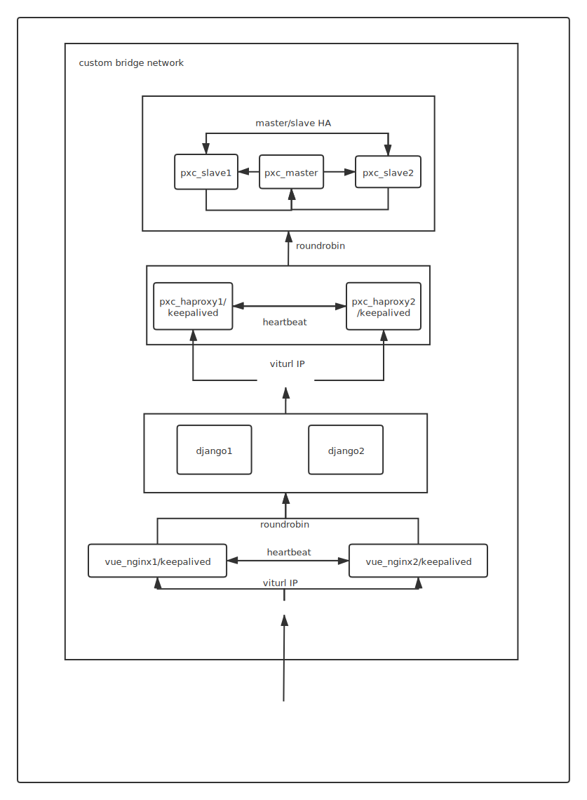

# Frontend Backend Deployment Demo 🐍

This repo is a simple demo to illustrate basic deployment structure of a seperated frontend/backend web project.

Tested on Ubuntu 19.10.

For simplicity, use docker with custom bridge network to avoid ip address or port conflict issue.

It uses [gtalarico/django-vue-template](https://github.com/gtalarico/django-vue-template) as frontend/backend components.

Basically there are four kind of components:
* `nginx` which serves frontend and also used as load balancer for backend, with `keepalived` for HA
* `django` backend
* `haproxy` used as load balancer for database, with `keepalived` for HA
* `percona xtradb cluster`(pxc) as database, with strong consistency.

Illustration

 
#### Prerequisites
 - docker
 - docker-compose [install](https://docs.docker.com/compose/install/)

#### Deploy
```
$ cd demo

# build all the relevant docker images
$ docker-compose build

# start all the services with all logs flushing.
# PXC cluster would take some time to be fully booted up and get ready, maybe 30 seconds.
# CTRL+C to stop containers.
$ docker-compose up

# stop some services to emulate nodes fault but services still function
$ bash fault.sh stop1

# restore some services to emulate transient fault
$ bash fault.sh restore1

# clear containers, volumes, and network
$ dokcer-compose down -v
```
 
#### Test
Access `http://172.30.0.100:8080` from host machine for frontend page.

Clicking `Django Rest` link on the page would guide you to where add or delete `(Subject, Message)` is possible, which touches the database.

Browser dev tools could help find the HTTP request/response states, to check the behavior of the system.

When deleting messages, you may find POST to endpoint `/api/messages/undefined/`.
It seems like a bug in the original [django-vue-template](https://github.com/gtalarico/django-vue-template) project.
Refesh the page and ignore it.

### Fault behavior
Use `fault.sh` to emulate fault and recovery of parts of the system.

`bash fault.sh stop1` removes half of the containers(`group1`) but the system still functions.

Virtual ip of `keepalived`, load balance/health check of `haproxy` and `nginx` make auto fault detection and recovery possible.

`bash fault.sh restore1` recreates and runs the containers of `group1`, making the system fully functional.

`stop2/restore2` arguments process the other group. 

## Questions

#### Why pxc master stops after boot
Ensure network, containers, volumes are cleared before running. Use `docker-compose down -v`.

#### After stop of part of the system, got 4xx or 5xx error when accessing /api/messages endpoint
Node heath check of nginx/haproxy could not be done in real time. 
Timeout and retry is used, so temporary failure is inevitable.
After several fail requests and several seconds, the system would be normal.

For more robust behavior and ensure minumum failure to client,
fully automatic fault detection/retry/recovery must be done in real time,
which is more complicated.

#### How to scale out load balancer
For load balancer(`haproxy`/`nginx`) or frontend(`nginx`),
since you can access only one load balancer through virtual ip at any given time,
simply add load balancer to the keepalived virtual ip group could not improve throughput performance.

If the load balancer is doing CPU intensive workds such as SSL offloading, then adding a lever 4 load balance layer before the current one is possible.
New load balance layer only does tcp packets forwarding, so throughput is not limited by CPU but NIC I/O.

If the load balancer performance is limited by NIC I/O, then single machine as entrypoint seems not enough.
Maybe DNS round robin strategy for several load balancer clusters can help.

Also check [here](https://serverfault.com/questions/268597/what-is-a-typical-method-to-scale-out-a-software-load-balancer)

#### How to scale out backend
Add more backend nodes and register them in downstream load balancer.

#### How to scale out database
Many factors shall be considered, read-heavy or write-heavy, strong or weak consistency, data model.

Choice of database type is important, such as key value store, RDBMS, graph database.
